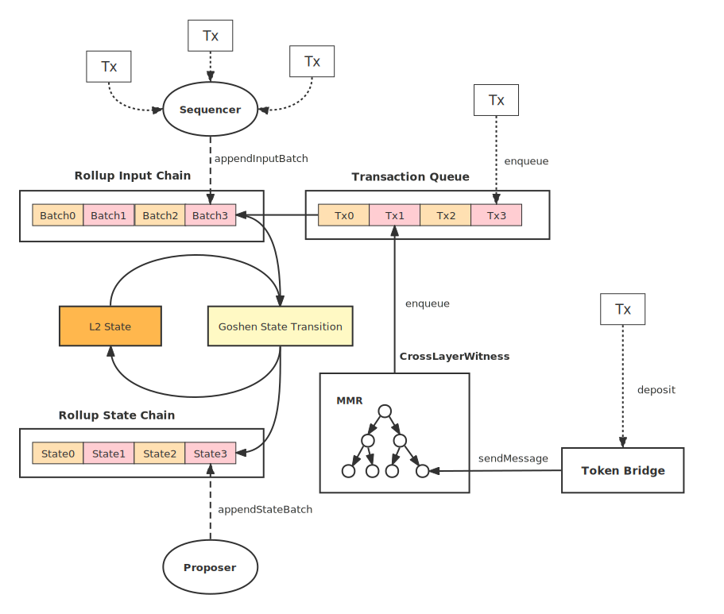
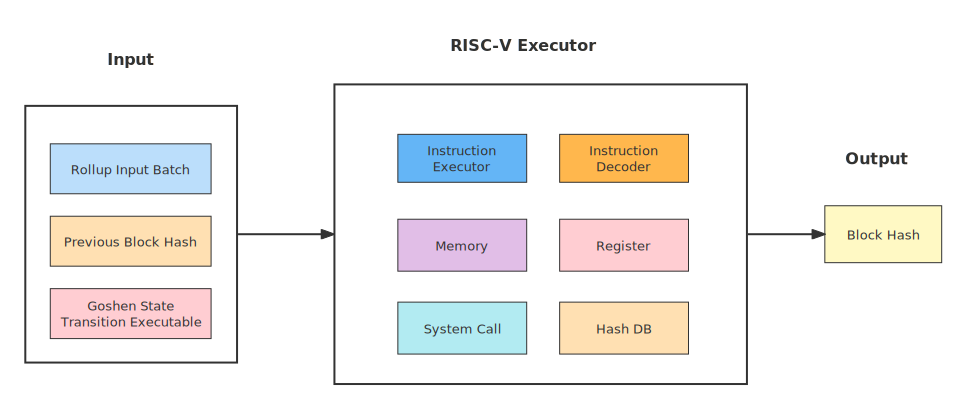

# Goshen State Transition

The State Transition component of the Goshen Network.

## What is Goshen network

Goshen network is an Optimistic rollup protocol to scale transaction throughput with lower gas cost while maintaining decentralization and security from Ethereum - the underlying main chain. The protocol uses a RISC-V machine to support on chain computing and in the event of challenges, it’s only necessary to identify "one step" in the RISC-V-Chain program to execute prune fraud state.

Goshen Network ensures simplicity and versatility with a layered architecture. At the bottom layer is a general-purpose computing environment for the L2, based on RISC-V, migrating L1 computations off-chain in a trustless manner. With this, L2 implements L1’s state transition logic, ensuring full compatibility with the L1 ecosystem. A reliable cross-layer message communication mechanism is further constructed to provide interoperability between L1 and L2 for building upper-layer applications such as a token bridge. For on-chain challenges, the interactive challenge protocol does not only reduce on-chain cost, but also improve the robustness of the protocol.

## Goshen Architecture

<figure></figure>

## State Transition Architecture

<figure></figure>
